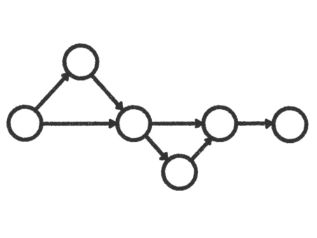
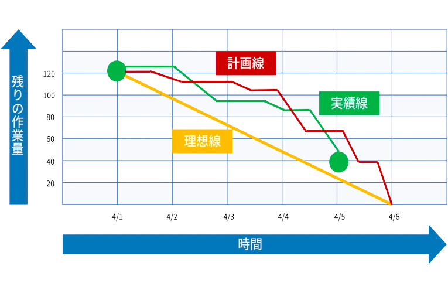
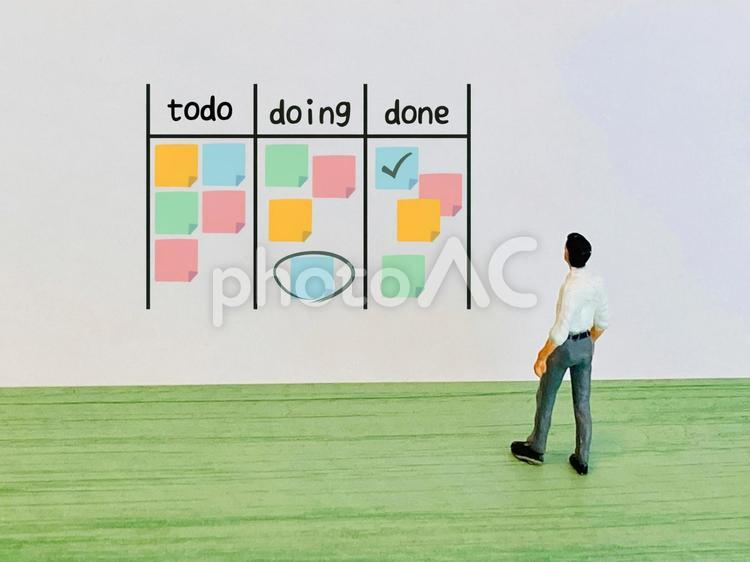

# 進捗管理技法

## 概要
- 進捗管理とは、作業計画と実際の作業状況のズレを把握すること。
- プロジェクト管理の一部として進捗管理がある。

## 必要な理由
1. 業務の漏れを防ぐ
    - スケジュールやタスクを可視化できるので優先順位を明確化でき、業務の抜け漏れの把握に繋がる。
2. 納期の遅延を防ぐ
    - リアルタイムで計画とのズレを把握することで問題の早期発見につながる。
    - 問題の発見後、早急な修正・対応を柔軟に行えるため、最終納品を送らせずに済む。
3. チーム内の意思共有が効率化する
    - 「いつ」「誰が」「何の業務を担当し」「いつまでに完了させるのか」をチーム内の共通認識にできる。
    - 進行状況が把握できることで、現在地や残タスクの量、納期までの期間などプロジェクトの全体感を把握しやすくなる。
4. 品質の低下を防ぐ
    - 納品間際で遅延が発覚した場合、必要な工程を短縮するなどにより品質低下を及ぼすこともある。

## 進捗管理技法
### 【タスク整理(プロジェクト開始前)】
1. **<u>PERT法</u>**
    - 主に確率や不確実性を考慮したプロジェクトのスケジュール見積もりに使用される。
    - 各工程の依存関係を図示して所要時間を見積もり、プロジェクト全体のスケジュールを評価するときに利用する。
    - 図にする時はアロー方式とフロー方式がある。(以下はアロー方式)
    - 
2. **<u>クリティカルパス法</u>**
    - プロジェクトを完了させるために実行しなければならないタスクを特定する手法。
    - 作業を繋げていった結果現れる最長経路のことをクリティカルパスという。
    - 上記のPERT図とセットで用いられることが多い。
        - PERTは時間の不確実性を扱うのに対し、クリティカルパス法はプロジェクトの最短期間を特定するために使用される。
3. **<u>WBS</u>**
    - プロジェクトを階層的な構造に分解し、各作業パッケージに細分化するための手法
    -　タスクを細分化することで抜け漏れの防止につながる。

### 【状況の可視化(プロジェクト進行中)】
1. **<u>ガントチャート</u>**
    - タスクやアクティビティを時間軸(開始日、終了日等)に沿って視覚的に表現し、進捗やスケジュールを把握するための手法。
    - プロジェクトの進捗を計画的に管理し、スケジュールの可視化を提供する。
    - 
2. **<u>バーンダウンチャート</u>**
    - スプリントやプロジェクトの進捗を視覚的に表示し、残りの作業量を示す。
    - プロジェクトの進捗を明確に伝え、作業の進行状況を管理する。
    - チャートは「実績線」「計画線」「理想線」の3つの線で表され、3つの線の位置関係から進捗状況や課題の有無などを読み解く。
    - 
3. **<u>カンバン方式</u>**
    - 「未着手」「進行中」「完了」などの列を用意し、タスクがこれらの列を移動することで進捗を可視化する。
    - ガントチャートとの違い
        - カンバンは作業の流れと進捗の可視化などのフロー志向で、ガントチャートは時間軸志向。
        - カンバンは柔軟に富んでいる、ガントチャートはより事前に計画されたスケジュールに従う。
    - 

### 【その他】
1. **<u>スクラム</u>**
    - アジャイル開発の手法で、一定期間ごとに成果物を提供することを目的とする。
    -  定期的なスプリントレビューで進捗を確認し、柔軟に変更に対応する。
2. **<u>KPIの利用</u>**
    - 重要なプロジェクトメトリクスやパフォーマンス指標を使用して進捗をモニタリングする手法。
    - プロジェクトの成功を定量的に測定し、側面ごとに数値で評価する。

## 失敗する要因
1. 信頼関係が構築されていない
    - チーム内での信頼関係が構築されていないと、ネガティブな報告が上がらずトラブルを素早く認知できない可能性がある。
    - その結果、現実との乖離が後になって顕在化する。
2. タスク量を把握しきれていない
    - 顕在化しているタスクが多く、後になって対応タスク・工数が増加される。
    - 初期の見積が甘く、そもそも無理な計画が敷かれている。
3. 情報共有不足
    - お互いの作業状況が分からないことで、プロジェクト全体の統一感がなくなり管理が煩わしくなる。
4. 目標設定がされていない
    - 各メンバーがそれぞれの理解で作業を進めてしまい、認識齟齬やズレが発生する。
    - その結果、出戻りや軌道修正など無駄な工程や工数が発生する。
5. 進捗状況が可視化されていない
    - 事前の計画との乖離が見えないことにより、納品等に影響が出る。

## 上手くいくためのコツ
1. 進捗状況の可視化
    - チャートや図表、進捗管理ツールなどを使用して進捗状況を可視化する。
2. タスクの細分化
    - 具体的なアクションレベルまで細分化することで、作業者による差異が生まれにくくなる。
    - 細分化することで、抜け漏れの把握や優先順位付けが容易になる。
3. 責任者の明確化
    - 責任者を設定することで情報の一元管理ができ、プロジェクトを円滑に進められる。
    - 責任者がいないと各従業員の業務状況を管理できず、進捗管理を適切に行えない。
4. 定期的な進捗報告
    - 認識齟齬が起こらぬようこまめな情報共有をする場を公に設ける。
5. 環境作り
    - ミスをした時や遅延が発生した時にすぐに報告できるよう心理的安全性を高める。
    - 不明点や疑問点をすぐ聞けるようコミュニケーションがとりやすい雰囲気の良いチームを作る